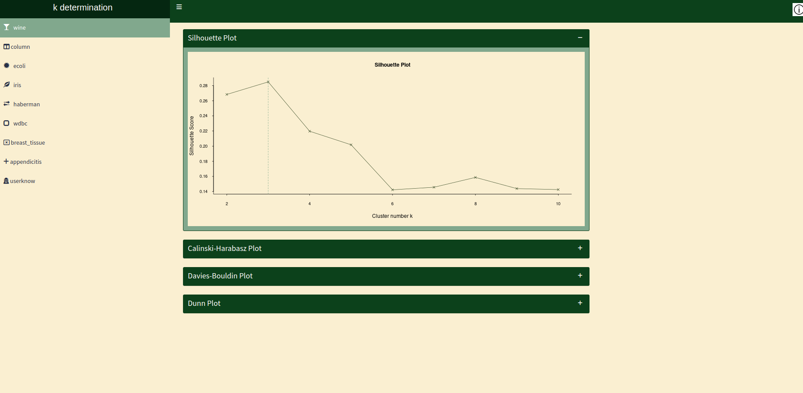

## k determination app

In this project, I turned the [optimal k project](https://github.com/ozturkfemre/optimal_k), which I previously shared as a repository, into a Shiny dashboard. In this dashboard, you can find the cluster number recommendations of Average Silhouette, Calinski-Harabasz, Davies-Bouldin, and Dunn Index methods for nine real data sets.

Gist of the app is created, so you can view the dashboard by writing the following code to your Rstudio or other IDEs:

`shiny::runGist("da55324b86e2998d14651015dced384b")`

Preview of the dashboard:

